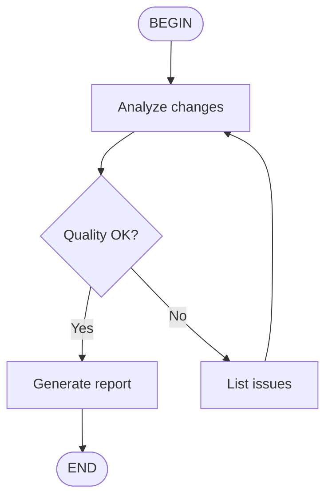

# Skill Creator Guide

Create high-quality Agent Skills that work across Kimi Code CLI, Claude Code, Codex, Gemini CLI, and other SKILL.md-compatible tools.

## What is a Skill?

A skill is a folder containing a `SKILL.md` file that teaches an AI agent how to do something specific, repeatable, and well. Think of it as a recipe card — clear enough for any capable agent to follow.

## Skill Structure

```
my-skill/
├── SKILL.md              # Required: main instructions
├── scripts/              # Optional: executable code for deterministic tasks
├── references/           # Optional: docs loaded on demand
└── assets/               # Optional: templates, icons, fonts
```

## Creating a Skill

### Step 1: Define the Trigger

The `description` in the YAML frontmatter is the PRIMARY mechanism that determines whether an agent uses your skill. Make it "pushy" — list every phrase and keyword that should trigger it.

**Bad description:**
```
description: Help with database migrations
```

**Good description:**
```
description: >
  Guide for creating, running, and troubleshooting database migrations.
  Use when the user mentions "migration", "schema change", "alter table",
  "database update", "add column", "create table", "migrate", "rollback",
  "seed data", or any database structure modification. Also trigger for
  ORM migration tools like Prisma migrate, Alembic, Knex, or TypeORM.
```

### Step 2: Write the SKILL.md

```markdown
---
name: my-skill-name
description: >
  [Pushy description with trigger keywords]
---

# Skill Title

[Core instructions — what the agent should do when this skill activates]

## When to Use
[Clear conditions for activation]

## Process
[Step-by-step workflow]

## Examples
[Concrete examples showing input → output]

## Guidelines
[Rules, anti-patterns, quality checks]
```

### Step 3: Keep It Lean

- **Target 1,500-2,000 words** for the SKILL.md body
- **Max 500 lines** — if longer, split into references/
- **Progressive disclosure** — put the critical path first, edge cases later
- Move detailed reference material to `references/` files
- Move executable logic to `scripts/` files

### Step 4: Write for Another Agent

Remember: the skill is used by ANOTHER instance of the agent, not you. Focus on:
- Information that's non-obvious to the model
- Procedural knowledge it wouldn't have by default
- Domain-specific details and gotchas
- Concrete examples, not abstract guidelines

## SKILL.md Format

### Required Frontmatter

```yaml
---
name: skill-name          # kebab-case, 1-64 chars, matches directory name
description: >            # 1-1024 chars, the trigger mechanism
  Detailed description with keywords...
---
```

### Optional Frontmatter

```yaml
license: MIT                    # License name or file reference
compatibility: requires python3 # Environment requirements (< 500 chars)
metadata:                       # Additional key-value pairs
  author: your-name
  version: 1.0
```

### Kimi-Specific: Flow Skills

Kimi Code CLI supports flow skills with Mermaid or D2 diagrams for multi-step automated workflows:

```yaml
---
name: code-review
description: Automated code review workflow
type: flow
---


```

Invoke with `/flow:code-review` for automatic multi-turn execution.

## Cross-Tool Compatibility

Skills are discovered from these paths (checked in order):

| Tool | User-Level Path | Project-Level Path |
|---|---|---|
| **Kimi CLI** | `~/.config/agents/skills/` | `.agents/skills/` |
| **Claude Code** | `~/.claude/skills/` | `.claude/skills/` |
| **Codex** | `~/.codex/skills/` | `.codex/skills/` |

Kimi also checks `~/.claude/skills/` and `~/.codex/skills/` as fallbacks, so skills written for those tools work in Kimi automatically.

For maximum compatibility:
- Use `~/.config/agents/skills/` (works everywhere)
- Or `.agents/skills/` at project level
- Keep SKILL.md as the only required file
- Use relative paths for referencing other files

## Quality Checklist

Before shipping a skill:

- [ ] **Description is pushy** — lists 5+ trigger phrases/keywords
- [ ] **Instructions are imperative** — "Do X", not "You could X"
- [ ] **Examples are concrete** — real file paths, real code, real outputs
- [ ] **Edge cases covered** — what to do when things go wrong
- [ ] **Under 500 lines** — detailed content in references/
- [ ] **Tested manually** — tried the skill with 3-5 realistic prompts
- [ ] **Anti-patterns listed** — what NOT to do is as valuable as what to do

## Improving an Existing Skill

1. **Test current triggering** — Try 10 prompts (5 should-trigger, 5 shouldn't)
2. **Identify gaps** — Where does it trigger wrong or miss?
3. **Refine the description** — Add missing keywords, narrow false triggers
4. **Update instructions** — Add examples for cases it handled poorly
5. **Re-test** — Verify improvements without regressions

## Example: Creating a "git-commits" Skill

```markdown
---
name: git-commits
description: >
  Git commit message conventions using Conventional Commits format.
  Use when the user asks about commit messages, wants to commit code,
  mentions "conventional commits", asks "how should I commit this",
  or when preparing to make a git commit after completing a task.
---

# Git Commit Conventions

Use Conventional Commits format for all git commits:

## Format
type(scope): description

## Allowed Types
- feat: New feature
- fix: Bug fix
- docs: Documentation only
- style: Formatting, no logic change
- refactor: Code restructure, no behavior change
- test: Adding or fixing tests
- chore: Build process, tooling, dependencies

## Rules
- Subject line under 72 characters
- Use imperative mood ("add" not "added")
- No period at the end
- Body explains WHY, not WHAT (the diff shows what)

## Examples
- feat(auth): add OAuth2 login with Google
- fix(api): handle null response in user query
- docs(readme): update installation instructions
- refactor(db): extract connection pooling to shared module
```
