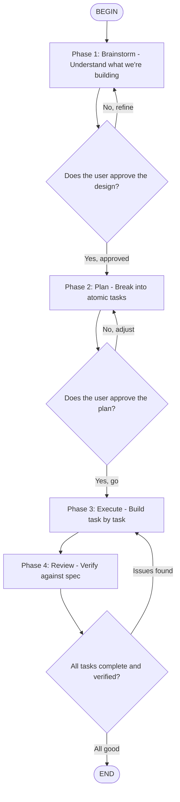

# Systematic Development Workflow

This skill enforces a disciplined build process: **Brainstorm → Plan → Execute → Review**.
Never skip phases. Each phase produces an artifact that feeds the next.



## Phase 1: Brainstorm

**Goal**: Understand what we're building before writing any code.

**Process:**
1. Listen to the user's request carefully
2. Ask clarifying questions (max 3-5, grouped, not one at a time)
3. Identify the core problem being solved
4. Explore 2-3 alternative approaches briefly
5. Propose a design in digestible chunks (not a wall of text)
6. Get explicit user approval before proceeding

**Output:** A brief design document covering:
- **Problem statement** (1-2 sentences)
- **Proposed solution** (key decisions, tech choices)
- **Scope** (what's IN, what's explicitly OUT)
- **Key risks** (what might go wrong)

**Rules:**
- Present the design in sections the user can actually read (not 50 paragraphs)
- If the user says "just build it", still state your assumptions explicitly
- Never assume requirements — ambiguity gets clarified, not guessed at

## Phase 2: Plan

**Goal**: Break work into atomic, verifiable tasks that could be executed by a fresh agent with no context beyond the task description.

**Process:**
1. Take the approved design
2. Break it into tasks of 2-10 minutes each
3. Each task must have:
   - **What**: Exact files to create/modify
   - **How**: Specific code changes or patterns to use
   - **Verify**: How to confirm the task is done correctly
4. Order tasks by dependency (build foundations first)
5. Group related tasks into logical batches

**Output:** A numbered task list. Example:
```
## Batch 1: Foundation
Task 1: Create project structure
  - Create: src/components/, src/hooks/, src/lib/, src/types/
  - Verify: All directories exist

Task 2: Set up base component with TypeScript interfaces
  - Create: src/types/index.ts with TaskItem, TaskList interfaces
  - Create: src/App.tsx with basic shell rendering "Hello"
  - Verify: App renders without errors

## Batch 2: Core Features
Task 3: Build TaskCard component
  - Create: src/components/TaskCard.tsx
  - Props: task: TaskItem, onToggle, onDelete
  - Verify: Renders task title, checkbox, delete button
  ...
```

**Rules:**
- Tasks should be independently verifiable
- No task should take more than 10 minutes
- Every task includes exact file paths
- Verification is concrete ("renders X", "API returns Y"), not vague ("works correctly")

## Phase 3: Execute

**Goal**: Build each task methodically, verifying as you go.

**Process:**
1. Work through tasks in order
2. For each task:
   a. State what you're about to do
   b. Write the code
   c. Verify it works (run tests, check output)
   d. If verification fails, fix before moving on
3. After each batch, pause for user checkpoint
4. Never skip verification

**Rules:**
- If a task reveals a design flaw, pause and discuss with user
- Don't silently deviate from the plan
- If you need to add an unplanned task, explain why
- Keep the user informed of progress ("Completed 4/12 tasks, starting Batch 2")

**God Mode Engineering Principles** (inspired by Pickle Rick):
- Every function must be tested or at minimum manually verified
- No placeholder code ships — everything does something real
- If you're unsure about an approach, try it and verify, don't guess
- Code should be clean enough that a reviewer would approve it first pass
- Technical debt is tracked, not ignored

## Phase 4: Review

**Goal**: Verify the complete implementation against the original spec.

**Checklist:**
1. **Functional completeness** — Does it do everything in the spec?
2. **Edge cases** — Empty states, errors, long content, rapid interactions?
3. **Code quality** — Clean, readable, no dead code, consistent style?
4. **Performance** — No obvious bottlenecks, unnecessary re-renders, blocking calls?
5. **Accessibility** — Semantic HTML, keyboard nav, screen reader friendly?
6. **Responsiveness** — Works at mobile, tablet, desktop widths?

**Output:** Brief report:
- ✅ What's working well
- ⚠️ Known limitations or shortcuts
- 🚀 Suggested improvements for next iteration

## When to Use This Skill

- **Always** for new projects or features
- **Always** when the task involves 3+ files
- **Optional** for small bug fixes or one-line changes
- **Recommended** when the user seems unsure about what they want

## Adapting to User Style

- If the user wants speed: compress Phase 1 into stated assumptions, keep Phase 2 brief
- If the user wants thoroughness: expand each phase, add more verification
- If the user says "just do it": state assumptions, build, then review together
- If the user provides a detailed spec: skip to Phase 2

The goal is not bureaucracy — it's preventing the expensive mistake of building the wrong thing.
